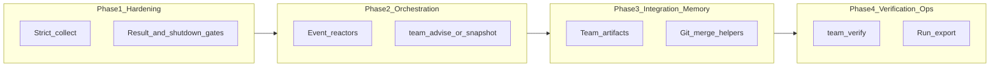

<!-- 3f702a95-3d49-4875-b282-3cc2b83b8d02 -->
---
todos:
  - id: "phase1-strict-collect"
    content: "Phase 1: Strict team_collect + TeamInfo policy fields + tests"
    status: pending
  - id: "phase2-advise-nudges"
    content: "Phase 2: team_advise (deterministic) + optional Bus nudges + stale/blocked plugin hooks"
    status: pending
  - id: "phase3-artifacts-git"
    content: "Phase 3: Storage-backed team artifacts + read-only git snapshot tool; mutating git behind explicit params"
    status: pending
  - id: "phase4-verify-ops"
    content: "Phase 4: team_verify, timeline/run export, deputy via schema or plugin; defer hard finish gate unless agreed"
    status: pending
  - id: "phase5-security-relay"
    content: "Phase 5: Optional per-member tool denylist + subtask completion observability hook"
    status: pending
isProject: false
---
# Agent teams: missing capabilities roadmap

## Context

Current implementation centers on [`packages/opencode/src/team/index.ts`](packages/opencode/src/team/index.ts) (state, spawn, budgets, worktrees), [`packages/opencode/src/tool/team.ts`](packages/opencode/src/tool/team.ts) and split tools (`team-collect.ts`, `team-inbox.ts`, etc.), [`packages/opencode/src/team/policy.ts`](packages/opencode/src/team/policy.ts) (plugin hooks), and [`packages/opencode/src/tool/team-collect.ts`](packages/opencode/src/tool/team-collect.ts) where **`scan()` treats `ready`/`shutdown` as collected without `team_submit_result`**, so “done” can be soft.

AGENTS.md asks to **minimize edits** to shared files (`session/prompt.ts`, `bootstrap.ts`, etc.). This plan **defaults new logic to `src/team/` + `src/tool/team*.ts` + [`packages/opencode/src/server/routes/team.ts`](packages/opencode/src/server/routes/team.ts)** and uses **plugins** for policy-heavy or org-specific behavior.

---

## Phase 1 — Completion invariants (highest ROI)

**Goal:** Make “collected / delivered” mean something checkable, without a full orchestration engine.

1. **Strict collection mode**  
   - Extend `team_collect` parameters (e.g. `require_structured_result`, `allow_idle_without_result`) and change [`team-collect.ts`](packages/opencode/src/tool/team-collect.ts) `scan()` so that, in strict mode, a member only counts as collected if there is a **fresh** `team_submit_result` (or inbox message with `type: "result"` / `metadata.result`) after `assigned_at`, **or** explicit opt-in (e.g. `waive: ["name"]` for human override).  
   - Keep today’s lenient behavior as **default** for backward compatibility.

2. **Team-level policy defaults**  
   - Add optional fields on `TeamInfo` in [`events.ts`](packages/opencode/src/team/events.ts) / create path in [`team_create`](packages/opencode/src/tool/team.ts): e.g. `collect_strict`, `require_result_before_shutdown`.  
   - When `require_result_before_shutdown` is true, [`Team.shutdown`](packages/opencode/src/team/index.ts) (or policy hook) can **block** shutdown if the member has in-progress assigned tasks without a submitted result (align with existing `TeamPolicy.shutdownBefore`).

3. **Tests**  
   - Extend [`team-collect.test.ts`](packages/opencode/test/team/team-collect.test.ts) (or add cases in [`team-phase4.test.ts`](packages/opencode/test/team/team-phase4.test.ts)) for strict vs lenient paths.

---

## Phase 2 — Lightweight orchestration (not a full scheduler)

**Goal:** Reduce “lead must remember every tool” without building a job queue.

1. **Read-only “state machine advisor” tool**  
   - New tool e.g. `team_advise` (or extend `team_status` with `detail: "actions"`) that returns a **deterministic checklist** from current `Team` + `TeamTasks` + inbox counts + `team_phase`: e.g. “spawn missing owners for unclaimed high-priority tasks”, “N members have no result since assignment”, “blocked tasks with unmet deps”, “pending spawn requests”.  
   - Implementation: small pure function in e.g. [`packages/opencode/src/team/advise.ts`](packages/opencode/src/team/advise.ts) (new file) to keep [`tool/team.ts`](packages/opencode/src/tool/team.ts) thin.

2. **Optional event-driven nudges (server-side)**  
   - Subscribe to existing [`TeamEvent`](packages/opencode/src/team/events.ts) (`TaskClaimed`, `ResultSubmitted`, `MemberStatusChanged`, etc.) in bootstrap (only if flag on): enqueue **low-noise** system messages to lead inbox via existing [`noticeLead` / messaging](packages/opencode/src/team/index.ts) patterns.  
   - **Gate** behind team option `automated_nudges: boolean` to avoid spam.

3. **Replanning hook (policy, not AI)**  
   - New plugin event e.g. `team.tasks.stale` or `team.blocked` fired when `team_health` detects stuck/blocked patterns, so external code can suggest task splits or auto-add tasks via existing APIs.

*Deferred (explicitly out of this phase):* a central job queue, DAG executor, or automatic spawn assignment—those need new storage and conflict rules.

---

## Phase 3 — Integration (git) and shared artifacts (memory)

**Goal:** Address “merge is out of band” and “shared memory is thin” with **small, auditable** primitives.

1. **Team artifacts store**  
   - New namespace under Storage (similar to `configKey` / `tasksKey` in [`index.ts`](packages/opencode/src/team/index.ts)): e.g. `["team_artifacts", projectId, teamName]` with append/list/get, **size caps** and MIME/text focus.  
   - New tools `team_artifact_append` / `team_artifact_list` (lead + optionally members with limits) for logs, links, command outputs.  
   - Optional: on `team_submit_result`, auto-append a one-line index entry (title + task_id).

2. **Git integration helpers**  
   - New module [`packages/opencode/src/team/git.ts`](packages/opencode/src/team/git.ts) wrapping **read-only** status/diff/log across member `worktreePath` values; tool `team_git_status` for lead.  
   - **Mutating** operations (`merge`, `rebase`, `push`) behind explicit tools with **confirmation text in parameters** and execution only in lead session or dedicated “integration” member—document risk; prefer `Bun.spawn` with allowlisted subcommands.

3. **Session distillation (optional, expensive)**  
   - Plugin hook `team.member.session_summarize` with **no default LLM call** in core: plugins can call models to post summaries into artifacts. Keeps core lean.

---

## Phase 4 — Verification, deputy lead, hard “delivery” gates (choose depth)

These items split into **core** vs **high-touch** integration.

### 4a — Aggregate verification (core-friendly)

- Tool `team_verify`: run a **configured command** (from opencode config or team create param) per member worktree **or** once at repo root, capture stdout/stderr + exit code, write to **artifacts**.  
- **Safety:** default deny; require explicit `verify_command` on team or env allowlist; short timeout; no shell by default (argv array only).

### 4b — Deputy lead / escalation (moderate schema change)

- Extend `TeamInfo` with optional `deputySessionID` and document routing: `team_message` to `lead` also copies to deputy inbox, or `TeamMessaging` fan-out when set.  
- **Alternative:** use existing plugin `team.message.sending` to implement fan-out without schema (faster, zero migration).

### 4c — Hard gate on final user reply (high conflict surface)

- Enforcing “lead cannot finish turn until `delivered`” requires changes near [`SessionPrompt.loop`](packages/opencode/src/session/prompt.ts) or equivalent finish path—**violates minimal-touch fork guidance**.  
- **Recommended approach:**  
  - **Soft:** stronger prompts + `team_advise` + strict `team_collect` (Phase 1–2).  
  - **Hard:** optional plugin hook `chat.finish` (if it exists or is added upstream) or a **user-facing** “team mode” UI flag—coordinate with upstream rather than forking deep loop logic.

### 4d — Operator UX

- Extend [`team.ts` routes](packages/opencode/src/server/routes/team.ts) with `GET /team/:name/timeline` aggregating events from `Bus` or a new **append-only** `team_run_log` in Storage (created on `team_create`).  
- Export JSON for debugging long runs.

---

## Phase 5 — Security and subagent relay (mostly policy + docs)

1. **Per-member tool denylist** (optional field on member or team scope)  
   - Map to extra `Session.setPermission` rules at spawn (same pattern as plan-approval denies in [`spawnMember`](packages/opencode/src/team/index.ts)).

2. **Subagent relay guard**  
   - When task/subtask parts complete for a team member session, optional hook publishes `team.delegate.completed` with **truncated** output hash/size so plugins or `team_health` can flag “large subtask finished but no `team_message` since”.

---

## Cross-cutting: documentation and plugins

- Document new team options and tools in [`packages/web/src/content/docs/tools.mdx`](packages/web/src/content/docs/tools.mdx) / [`agents.mdx`](packages/web/src/content/docs/agents.mdx).  
- Add plugin hook names to [`packages/plugin`](packages/plugin) types if new hooks are introduced.  
- After each phase: `bun run typecheck` from `packages/opencode` per AGENTS.md.

---

## Suggested implementation order

| Order | Phase | Why |
|-------|--------|-----|
| 1 | Phase 1 | Fixes false “done” with localized changes |
| 2 | Phase 2 | Improves lead behavior without new async workers |
| 3 | Phase 3 artifacts + git read-only | Unblocks integration visibility |
| 4 | Phase 4a verification | Objective pass/fail for hard tasks |
| 5 | Phase 3 git mutating / Phase 4b deputy | Higher risk; do after basics stable |
| 6 | Phase 4c hard finish gate | Only if product agrees to touch prompt loop or add upstream hook |

---

## Explicit non-goals (for this plan)

- Full **multi-lead consensus** or Byzantine coordination.  
- Built-in **vector RAG** over the repo (use plugins or external retrieval).  
- **Automatic merge conflict resolution** by LLM inside core (too risky; assist with status/diff only).  
- Replacing upstream **DB-backed teams** ([PR #18753](https://github.com/anomalyco/opencode))—reconcile when upstream merges.
